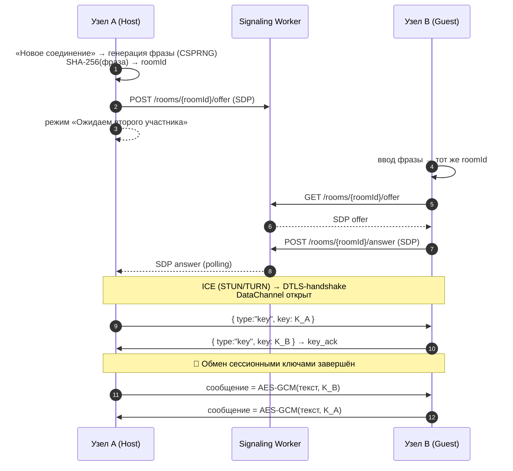

<div align="center">


# /0byte/

**Децентрализованный P2P-мессенджер с end-to-end шифрованием.**
Без аккаунтов. Без серверов хранения. Без следов.

Сообщения существуют только на устройствах собеседников,
соединение устанавливается по **секретной фразе**,
а ключи шифрования никогда не покидают ваши устройства.

[](https://developer.mozilla.org/docs/Web/API/Web_Crypto_API)
[](https://webrtc.org)
[](#)
[](#-лицензия)
[](#)

[Быстрый старт](#-быстрый-старт) • [Как создать чат](#-как-создать-чат) • [Безопасность](#-модель-безопасности) • [Roadmap](#-roadmap)

</div>

---

## ✨ Возможности

- 🔐 **E2E-шифрование** — AES-256-GCM со случайным IV для каждого сообщения;
- 🔗 **Секретная фраза вместо SDP** — никаких простыней base64: фраза вида `тихий-волк-042`, произнесённая голосом или переданная в доверенном канале;
- 🧩 **Автораспределение ролей** — кто Host, кто Guest, узлы договариваются сами;
- 💾 **Шифрование at-rest** — контакты и история в `localStorage` защищены мастер-паролем (PBKDF2 → AES-GCM). Можно работать и без пароля;
- 🔄 **Ротация ключей** — каждая новая сессия создаёт свежие сессионные ключи, старые сохраняются для расшифровки истории;
- 🖼 **Зашифрованные изображения** — со сжатием на стороне клиента (до 800 px, JPEG 0.85);
- 🌗 Тёмная / светлая тема, адаптивный UI, glassmorphism-дизайн;
- ⚡ **Ноль зависимостей** — чистый vanilla JS + Web Crypto API + WebRTC.

---

## 🧠 Как это работает

Сигнальный сервер (Cloudflare Worker) передаёт **только SDP** и не видит ни сообщений, ни ключей. После handshake трафик идёт напрямую между браузерами.



1. **Фраза → комната.** Нормализованная фраза хэшируется SHA-256, первые 16 hex-символов становятся `roomId`.
2. **Signaling.** Host публикует offer, Guest забирает его и публикует answer. Комната закрывается сразу после установки канала.
3. **P2P-канал.** WebRTC DataChannel (`ordered`) через STUN/TURN — работает даже за строгими NAT.
4. **Обмен ключами.** Каждый узел генерирует 256-битный сессионный ключ (CSPRNG) и отправляет его по каналу; ретрансляция продолжается до `key_ack`.
5. **Шифрование.** Исходящее шифруется ключом собеседника, входящее расшифровывается своим; история хранится локально.

---

## 🔒 Модель безопасности


| Слой | Примитив | Где применяется |
|---|---|---|
| Транспорт | WebRTC DataChannel (DTLS) | прямой канал узел↔узел |
| Сообщения и файлы | **AES-256-GCM**, случайный IV 12 B | `crypto.js → encrypt / encryptData` |
| Сессионные ключи | 256-bit CSPRNG, обмен `key` / `key_ack` | только в памяти + локальные key-листы |
| Мастер-пароль (at-rest) | **PBKDF2-SHA-256 · 100 000 итераций · salt 16 B** → AES-256-GCM | контакты и история в `localStorage` |
| Идентификатор комнаты | `SHA-256(фраза)[0:16]` | signaling |
| Секретная фраза | CSPRNG, формат «прилагательное-существоительное-NNN», ≈ 5,8 млн комбинаций | передаётся в доверенном канале |

> ⚠️ **Честный дисклеймер.** Фраза — одноразовый ключ доступа к комнате signaling; передавайте её голосом или лично. Проект исследовательский, независимого аудита не проходил. Утеря мастер-пароля = безвозвратная потеря данных (это фича, а не баг).

---

## 🚀 Быстрый старт

```bash
git clone https://github.com/USERNAME/0byte-mesh.git
cd 0byte-mesh

# любой статический сервер; Web Crypto требует secure context
npx serve -l 8080 .          # → http://localhost:8080
# или
python3 -m http.server 8080
```

> `crypto.subtle` доступен только в **secure context**: `localhost` или HTTPS. GitHub Pages / Cloudflare Pages подходят из коробки.

### Конфигурация под себя

| Что | Где | Зачем |
|---|---|---|
| `SIGNALING_URL` | `webrtc.js` | URL вашего signaling-воркера |
| `ICE_CONFIG.iceServers` | `webrtc.js` | свои STUN/TURN-серверы (вместо демо-учётки Metered) |

---

## 💬 Как создать чат


<!-- Опционально: раскомментируйте, когда запишете демо

-->

**Узел A (инициатор):**
1. Откройте приложение, примите протокол, при желании задайте мастер-пароль;
2. Нажмите **«Новое соединение»** → иконку кубика 🎲 — появится фраза, например `ТИХИЙ-ВОЛК-042`;
3. Продиктуйте фразу собеседнику (лично, по телефону — любому доверенному каналу);
4. Дождитесь статуса «Ожидаем второго участника» → «Защищённое соединение установлено».

**Узел B (собеседник):**
1. Откройте приложение на своём устройстве;
2. **«Новое соединение»** → вставьте или введите фразу → **«Установить соединение»**;
3. Роли Host/Guest распределятся автоматически, ключи обменяются сами — индикатор загорится зелёным: `защищённый канал`.

**Повторное подключение:** фраза сохраняется у контакта — достаточно кнопки **«Переподключиться»** в баннере чата.

---

## 🗂 Структура проекта

| Файл | Ответственность |
|---|---|
| `index.html` | каркас UI, модалки (EULA, мастер-пароль, новая сессия, настройки), SVG-спрайт |
| `style.css` | дизайн-система «gunmetal + ice», темы, адаптив |
| `ui.js` | рендер контактов/сообщений, лайтбокс, тосты, настройки, темы |
| `crypto.js` | Web Crypto: AES-GCM, PBKDF2, SHA-256, сжатие изображений |
| `webrtc.js` | signaling, ICE/TURN, DataChannel, обмен ключами, персист истории |

### Что хранится локально (`localStorage`)

| Ключ | Содержимое |
|---|---|
| `uid` | анонимный идентификатор узла |
| `contacts_encrypted` / `contacts` | контакты + key-листы (AES-GCM при мастер-пароле) |
| `history_<A_B>` | история переписки, шифрованная at-rest |
| `master_salt` | соль PBKDF2 (16 B) |
| `myName`, `theme`, `activePeer`, `eula_accepted` | профиль и служебное |

На любом сервере остаются **только эфемерные SDP** до установки канала.

---

## 🌐 Совместимость

| Chrome / Edge | Firefox | Safari |
|:---:|:---:|:---:|
| ✅ 90+ | ✅ 88+ | ✅ 15+ |

Требуется поддержка WebRTC и Web Crypto API. Мобильные браузеры поддерживаются (адаптивный UI).

---

## 🛣 Roadmap

- [ ] QR-код секретной фразы для мгновенного пейринга;
- [ ] SAS-верификация канала голосом (отпечаток → словесный код; задел уже в `CryptoSystem.generateVoiceCode`);
- [ ] одновременные соединения с несколькими пирами;
- [ ] саморазрушающиеся сообщения;
- [ ] передача произвольных файлов;
- [ ] экспорт/импорт зашифрованного бэкапа.

---

## ⚖️ Лицензия

MIT — используйте свободно, на свой страх и риск. См. [`LICENSE`](LICENSE).

---

<div align="center">

Сделано с 🖤 и Web Crypto API · **/0byte/** · 2026

</div>
